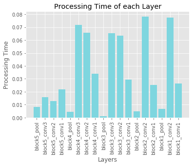

# Performance Estimator for Keras Models
*WARNING - Under Construction

Developed and tested on keras 2.2.4.

# Keras FLOP Estimator

This is a function for estimating the floating point operations (FLOPS) of deep learning models developed with keras. It supports some basic layers such as Convolutional, Separable Convolution, Depthwise Convolution, BatchNormalization, Activations, and Merge Layers (Add, Max, Concatenate)

### Usage

```python

from keras.applications.mobilenetv2 import MobileNetV2

model = MobileNetV2(weights=None, include_top=True, pooling=None,input_shape=(224,224,3))
model.summary()

#Prints a table with the FLOPS at each layer and total FLOPs
net_flops(model)

```

### Output
```
   Layer Name |      Input Shape |     Output Shape |      Kernel Size |          Filters | Strides | BFLOPS
--------------------------------------------------------------------------------------------------------------------------------------------------------------------------
                  input_2 |    [224, 224, 3] |    [224, 224, 3] |           [0, 0] |           [0, 0] | [1, 1] | 0.0000
                Conv1_pad |     ['', '', ''] |     ['', '', ''] |           [0, 0] |           [0, 0] | [1, 1] | 0.0000
                    Conv1 |    [225, 225, 3] |   [112, 112, 32] |           (3, 3) |               32 | (2, 2) | 21.8700
                 bn_Conv1 |   [112, 112, 32] |   [112, 112, 32] |           [0, 0] |           [0, 0] | [1, 1] | 0.4014
               Conv1_relu |   [112, 112, 32] |   [112, 112, 32] |           [0, 0] |           [0, 0] | [1, 1] | 0.4014
  expanded_conv_depthwise |   [112, 112, 32] |   [112, 112, 32] |           (3, 3) |               32 | (1, 1) | 7.2253
expanded_conv_depthwise_BN |   [112, 112, 32] |   [112, 112, 32] |           [0, 0] |           [0, 0] | [1, 1] | 0.4014
expanded_conv_depthwise_relu |   [112, 112, 32] |   [112, 112, 32] |           [0, 0] |           [0, 0] | [1, 1] | 0.4014
    expanded_conv_project |   [112, 112, 32] |   [112, 112, 16] |           (1, 1) |               16 | (1, 1) | 12.8451
 expanded_conv_project_BN |   [112, 112, 16] |   [112, 112, 16] |           [0, 0] |           [0, 0] | [1, 1] | 0.2007
           block_1_expand |   [112, 112, 16] |   [112, 112, 96] |           (1, 1) |               96 | (1, 1) | 38.5352
        block_1_expand_BN |   [112, 112, 96] |   [112, 112, 96] |           [0, 0] |           [0, 0] | [1, 1] | 1.2042
      block_1_expand_relu |   [112, 112, 96] |   [112, 112, 96] |           [0, 0] |           [0, 0] | [1, 1] | 1.2042
              block_1_pad |     ['', '', ''] |     ['', '', ''] |           [0, 0] |           [0, 0] | [1, 1] | 0.0000
        block_1_depthwise |   [113, 113, 96] |     [56, 56, 96] |           (3, 3) |               96 | (2, 2) | 5.5162
     block_1_depthwise_BN |     [56, 56, 96] |     [56, 56, 96] |           [0, 0] |           [0, 0] | [1, 1] | 0.3011
   block_1_depthwise_relu |     [56, 56, 96] |     [56, 56, 96] |           [0, 0] |           [0, 0] | [1, 1] | 0.3011
          block_1_project |     [56, 56, 96] |     [56, 56, 24] |           (1, 1) |               24 | (1, 1) | 14.4507
       block_1_project_BN |     [56, 56, 24] |     [56, 56, 24] |           [0, 0] |           [0, 0] | [1, 1] | 0.0753
           block_2_expand |     [56, 56, 24] |    [56, 56, 144] |           (1, 1) |              144 | (1, 1) | 21.6760
        block_2_expand_BN |    [56, 56, 144] |    [56, 56, 144] |           [0, 0] |           [0, 0] | [1, 1] | 0.4516
      block_2_expand_relu |    [56, 56, 144] |    [56, 56, 144] |           [0, 0] |           [0, 0] | [1, 1] | 0.4516
        block_2_depthwise |    [56, 56, 144] |    [56, 56, 144] |           (3, 3) |              144 | (1, 1) | 8.1285
```

# Keras Model Timing Performannce Per Layer

This is a function for estimating the timing performance of each leayer in a neural network. It can be used to identify the bottlenecks in computation when run on the target device. The function iterates over the network by runninng an input image through it by removing each of the layers. The layer time is found by subtracting the current run without the last layer from the previous run that contained the layer. There are some timing issues where the timings are off a bit thus some times may appear as negative. In such, case the layer compute time can be considered as negligible.

### Usage

```python

from keras.applications.vgg16 import VGG16
model = VGG16(weights='imagenet', include_top=False)

times = time_per_layer(model)

# Visualize

import matplotlib.pyplot as plt

plt.style.use('ggplot')
x = [model.layers[-i].name for i in range(1,len(model.layers))]
#x = [i for i in range(1,len(model.layers))]
g = [times[i,0] for i in range(1,len(times))]
x_pos = np.arange(len(x))
plt.bar(x, g, color='#7ed6df')
plt.xlabel("Layers")
plt.ylabel("Processing Time")
plt.title("Processing Time of each Layer")
plt.xticks(x_pos, x,rotation=90)

plt.show()

```
### Output Graph



# Resources:
1. [Convolutional Neural Networks Cheatsheet](https://stanford.edu/~shervine/teaching/cs-230/cheatsheet-convolutional-neural-networks)
2. [How fast is my model?](https://machinethink.net/blog/how-fast-is-my-model/)
3. [3 Small But Powerful Convolutional Networks](https://towardsdatascience.com/3-small-but-powerful-convolutional-networks-27ef86faa42d)
