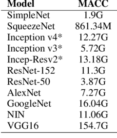

# Performance Estimator for Keras Models
*WARNING - Under Construction - Code will Follow

Developed and tested on keras 2.2.4.

# Keras FLOP Estimator

This is a function for estimating the floating point operations (FLOPS) of deep learning models developed with keras. It supports some basic layers such as Convolutional, Separable Convolution, Depthwise Convolution, BatchNormalization, Activations, and Merge Layers (Add, Max, Concatenate)

### Usage

```python

from keras.applications.resnet50 import ResNet50
from keras.applications.vgg16 import VGG16
from keras.applications.mobilenet import MobileNet

model = VGG16(weights=None, include_top=True, pooling=None,input_shape=(224,224,3))
model.summary()

#Prints a table with the FLOPS at each layer and total FLOPs
net_flops(model,table=True)

```

### Output
```
               Layer Name |      Input Shape |     Output Shape |      Kernel Size |          Filters | Strides |  FLOPS
----------------------------------------------------------------------------------------------------------------------------------------
                 input_11 |    [224, 224, 3] |    [224, 224, 3] |           [0, 0] |           [0, 0] | [1, 1] | 0.0000
             block1_conv1 |    [224, 224, 3] |   [224, 224, 64] |           (3, 3) |               64 | (1, 1) | 173408256.0000
             block1_conv2 |   [224, 224, 64] |   [224, 224, 64] |           (3, 3) |               64 | (1, 1) | 3699376128.0000
              block1_pool |   [224, 224, 64] |     ['', '', ''] |           (2, 2) |           [0, 0] | (2, 2) | 3211264.0000
             block2_conv1 |   [112, 112, 64] |  [112, 112, 128] |           (3, 3) |              128 | (1, 1) | 1849688064.0000
             block2_conv2 |  [112, 112, 128] |  [112, 112, 128] |           (3, 3) |              128 | (1, 1) | 3699376128.0000
              block2_pool |  [112, 112, 128] |     ['', '', ''] |           (2, 2) |           [0, 0] | (2, 2) | 1605632.0000
             block3_conv1 |    [56, 56, 128] |    [56, 56, 256] |           (3, 3) |              256 | (1, 1) | 1849688064.0000
             block3_conv2 |    [56, 56, 256] |    [56, 56, 256] |           (3, 3) |              256 | (1, 1) | 3699376128.0000
             block3_conv3 |    [56, 56, 256] |    [56, 56, 256] |           (3, 3) |              256 | (1, 1) | 3699376128.0000
              block3_pool |    [56, 56, 256] |     ['', '', ''] |           (2, 2) |           [0, 0] | (2, 2) | 802816.0000
             block4_conv1 |    [28, 28, 256] |    [28, 28, 512] |           (3, 3) |              512 | (1, 1) | 1849688064.0000
             block4_conv2 |    [28, 28, 512] |    [28, 28, 512] |           (3, 3) |              512 | (1, 1) | 3699376128.0000
             block4_conv3 |    [28, 28, 512] |    [28, 28, 512] |           (3, 3) |              512 | (1, 1) | 3699376128.0000
              block4_pool |    [28, 28, 512] |     ['', '', ''] |           (2, 2) |           [0, 0] | (2, 2) | 401408.0000
             block5_conv1 |    [14, 14, 512] |    [14, 14, 512] |           (3, 3) |              512 | (1, 1) | 924844032.0000
             block5_conv2 |    [14, 14, 512] |    [14, 14, 512] |           (3, 3) |              512 | (1, 1) | 924844032.0000
             block5_conv3 |    [14, 14, 512] |    [14, 14, 512] |           (3, 3) |              512 | (1, 1) | 924844032.0000
              block5_pool |    [14, 14, 512] |     ['', '', ''] |           (2, 2) |           [0, 0] | (2, 2) | 100352.0000
                  flatten |      [7, 7, 512] |            25088 |           [0, 0] |           [0, 0] | [1, 1] | 0.0000
                      fc1 |            25088 |           [4096] |           [0, 0] |           [0, 0] | [1, 1] | 205520896.0000
                      fc2 |             4096 |           [4096] |           [0, 0] |           [0, 0] | [1, 1] | 33554432.0000
              predictions |             4096 |           [1000] |           [0, 0] |           [0, 0] | [1, 1] | 8192000.0000

Total FLOPS (x 10^6): 30946.65011200


Total MACC (x 10^6): 15470264320.00000000
```



# Keras Model Timing Performannce Per Layer

This is a function for estimating the timing performance of each leayer in a neural network. It can be used to identify the bottlenecks in computation when run on the target device. The function iterates over the network by runninng an input image through it by removing each of the layers. The layer time is found by subtracting the current run without the last layer from the previous run that contained the layer. There are some timing issues where the timings are off a bit thus some times may appear as negative. In such, case the layer compute time can be considered as negligible.

### Usage

```python

from keras.applications.vgg16 import VGG16
model = VGG16(weights='imagenet', include_top=False)

times = time_per_layer(model)

# Visualize

import matplotlib.pyplot as plt

plt.style.use('ggplot')
x = [model.layers[-i].name for i in range(1,len(model.layers))]
#x = [i for i in range(1,len(model.layers))]
g = [times[i,0] for i in range(1,len(times))]
x_pos = np.arange(len(x))
plt.bar(x, g, color='#7ed6df')
plt.xlabel("Layers")
plt.ylabel("Processing Time")
plt.title("Processing Time of each Layer")
plt.xticks(x_pos, x,rotation=90)

plt.show()

```
### Output Graph


# Disclaimer:

This code is provided as is and there might be some errors especially with the timing as it depends on many factors. In many papers the same number can be reporter under either FLOPs or MACCs. By definition these two quantities are not the same and care must be taken as to which one you want to report and compare against. For example MobileNetV1 paper it is reported to have ~569 MACCs in the paper. However, many leaderboarding sites put this metric under FLOPS which may also include other operations. In the provided function, FLOPS can be any operation such as addition, subtraction, comparison, etc.  

# Resources:
1. [Convolutional Neural Networks Cheatsheet](https://stanford.edu/~shervine/teaching/cs-230/cheatsheet-convolutional-neural-networks)
2. [How fast is my model?](https://machinethink.net/blog/how-fast-is-my-model/)
3. [3 Small But Powerful Convolutional Networks](https://towardsdatascience.com/3-small-but-powerful-convolutional-networks-27ef86faa42d)
